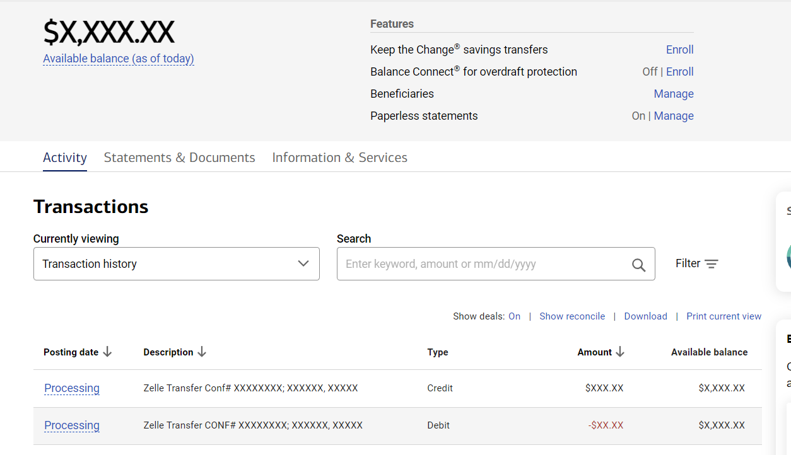
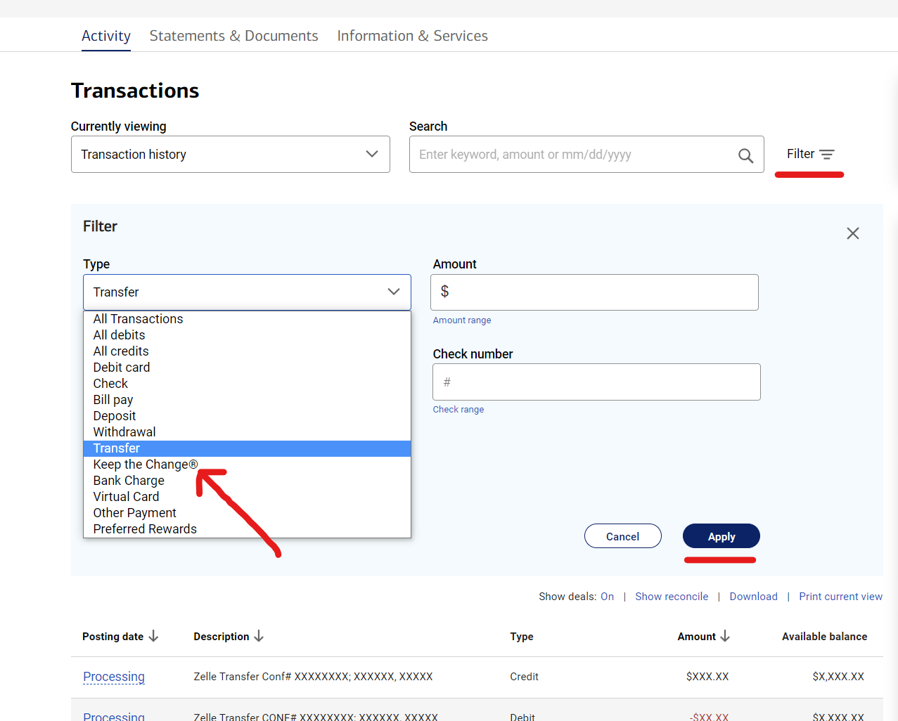
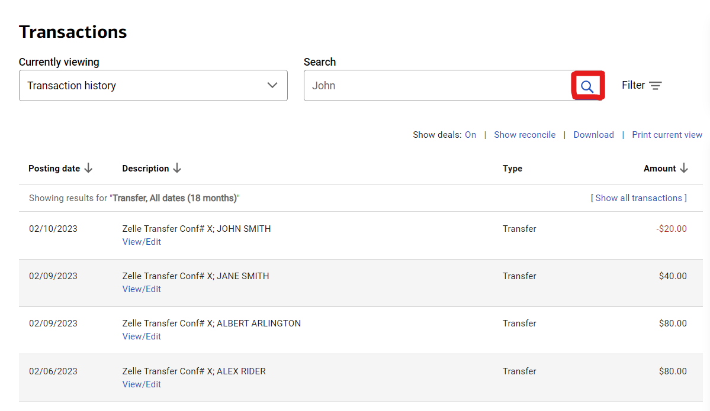
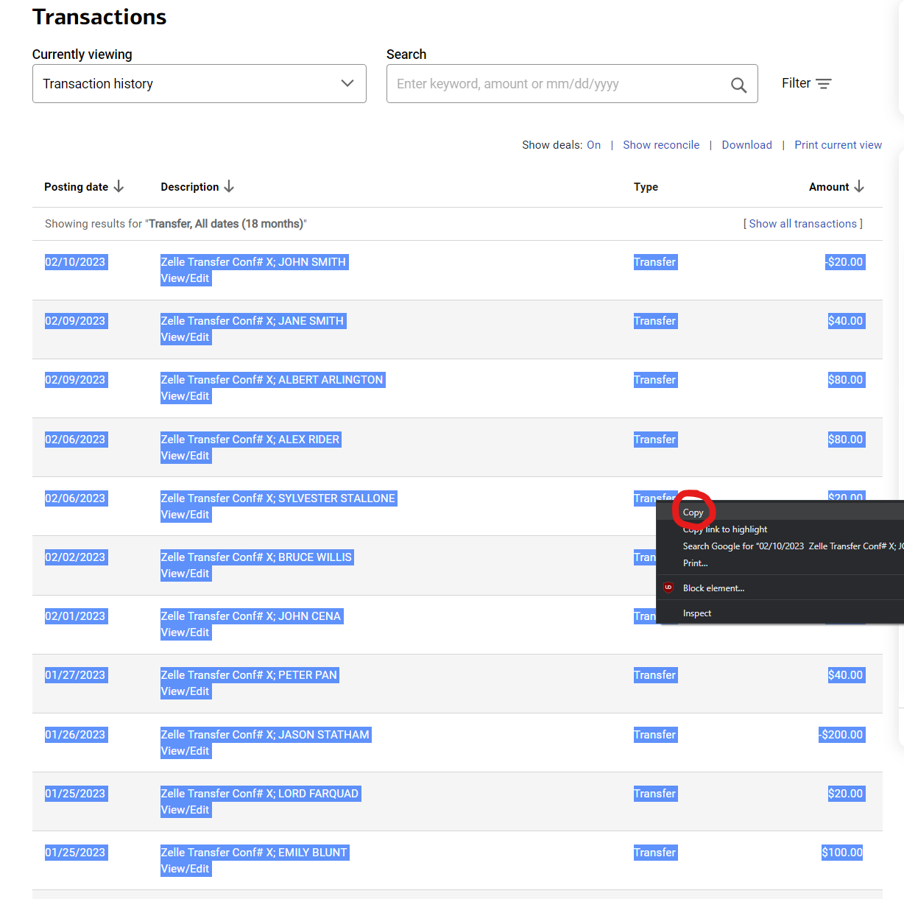
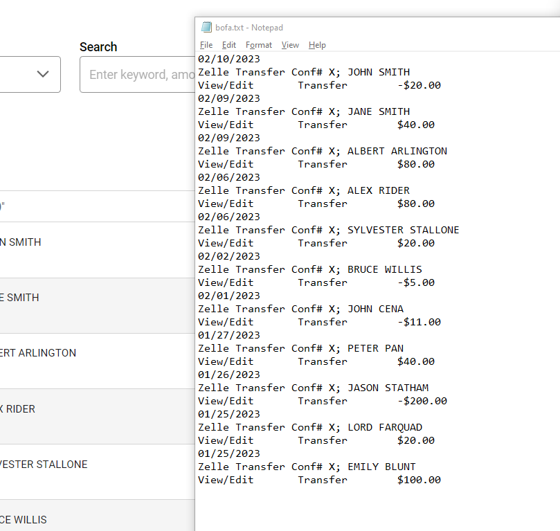

# BOFA Transfer Counter

This is a simple script used to count the number of transfers and the total amount of money sent/received in a Bank of America Account Activity page using regular expressions.
Instructions on how to use it are below.

## Instructions

1. Clone the repository or download as zip. Extract the zip wherever you want.

2. Open a new tab on your browser. Navigate to your desired Bank of America account.

3. Click on the "Activity" tab.

4. Click on the Filter button on the right. Filter by Tranfers.

5. (Optional) You can filter by a search term, such as a person's name.

6. Copy the contents of the transactions section.

7. Open bofa.txt. You will see placeholder data, you can overwrite it. Paste contents into this file. This file must exist in the same directory as the script (bofa_money_counter.py). You do not have to format any data after pasting.

8. Run the script. Instructions on how to run the script are below.

9. Enjoy!

## Usage
Open your terminal/command prompt and navigate to the directory where the extracted files are located.

For Mac/Linux, run the following command:
    
    python3 bofa_money_counter.py
    
For Windows, if you do NOT have python installed, run the following command:
    
    .\dist\bofa_money_counter\bofa_money_counter.exe

For Windows, if you have python installed, run the following command:
    
    python bofa_money_counter.py

## Notes

* Any file not named bofa.txt will be ignored.
* The script will count all transfers, including those that are processing. Anything pasted into bofa.txt will be counted.
* This can theoretically work with any bank, but the regex was built for Bank of America. (Money will be caught by the regex, but not the names of people.)
* THIS IS NOT MALWARE. The source code is available for you to see.