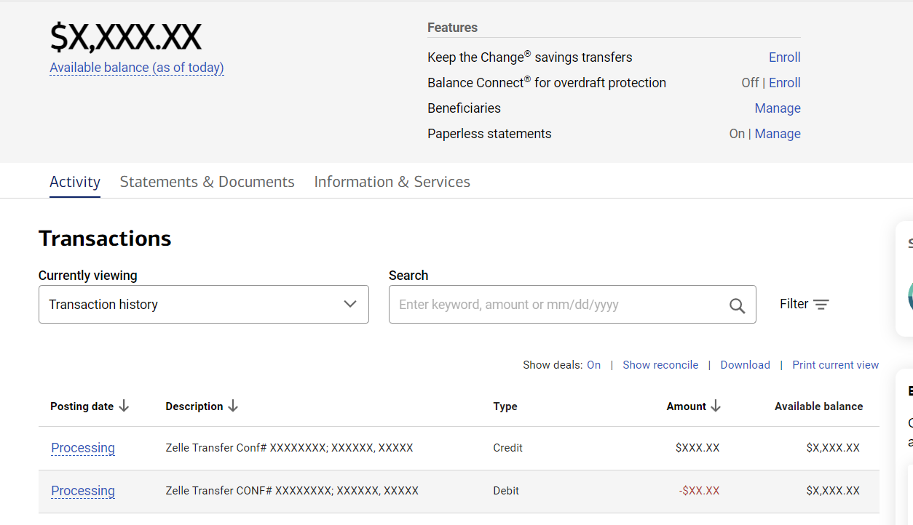
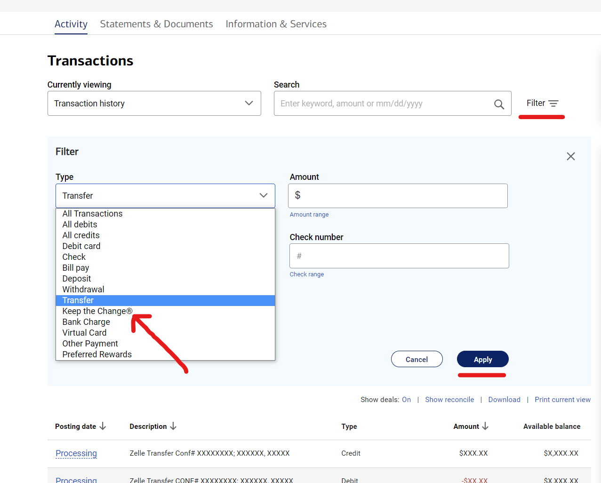
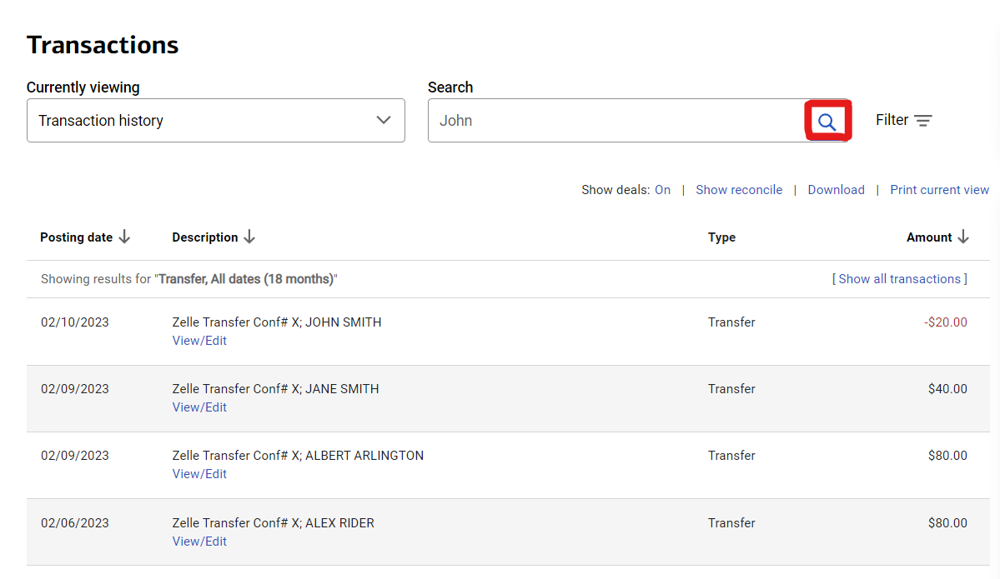
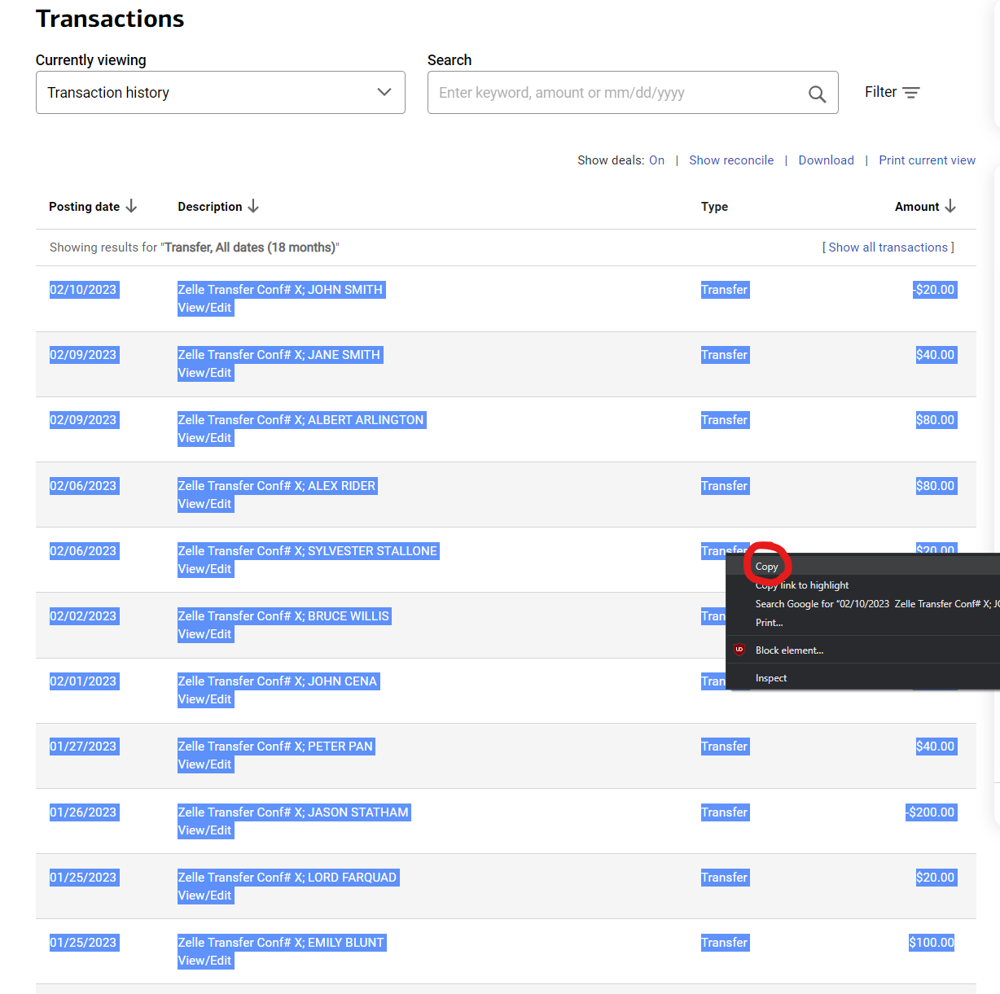
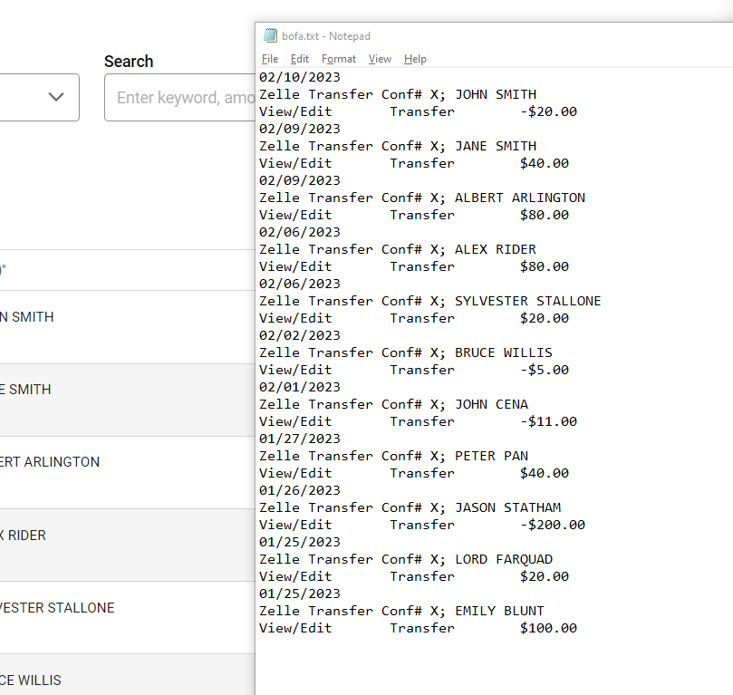

# BOFA Transfer Counter

This is a simple script used to count the number of transfers in a Bank of America Account Activity page using regular expressions.
Instructions on how to use it are below.

## Instructions

1. Clone the repository or download as zip. 

2. Open a new tab on your browser. Navigate to your desired Bank of America account.

3. Click on the "Activity" tab.

4. Click on the Filter button on the right. Filter by Tranfers.

5. (Optional) You can filter by a search term, such as a person's name.

6. Copy the contents of the transactions section.

7. Open bofa.txt. You will see placeholder data, you can overwrite it. Paste contents into this file. This file must exist in the same directory as the script (bofa_money_counter.py).

8. Run the script. Instructions on how to run the script depend on your operating system.

9. Enjoy!

## Usage
For Mac/Linux, open your terminal and run the following command:
    
    python3 bofa_money_counter.py
    
For Windows, if you do NOT have python installed, open your command prompt and run the following command:
    
    .\dist\bofa_money_counter\bofa_money_counter.exe

For Windows, if you have python installed, open your command prompt and run the following command:
    
    python bofa_money_counter.py

## Notes

* Any file not named bofa.txt will be ignored.
* The script will count all transfers, including those that are processing.
* THIS IS NOT MALWARE. The source code is available for you to see.